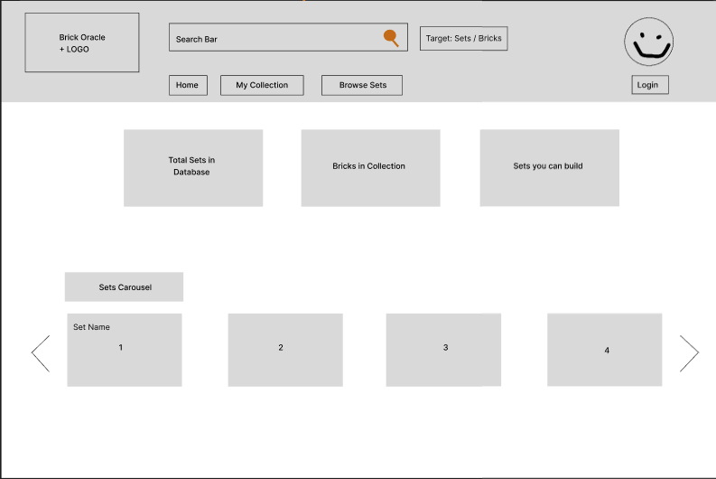
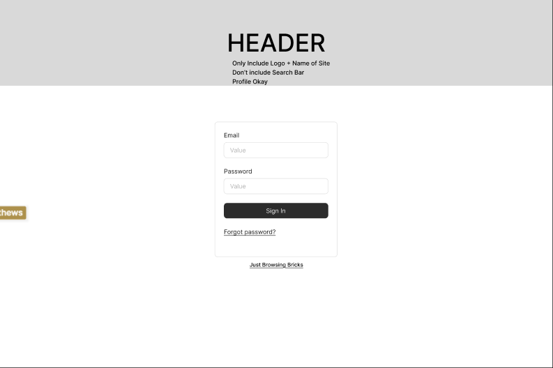
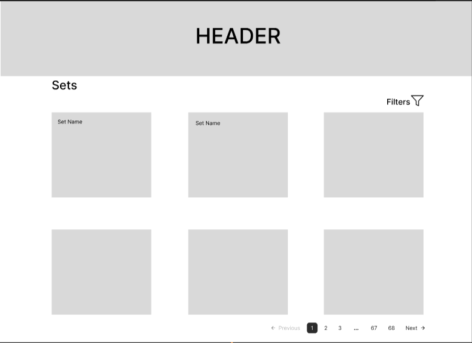
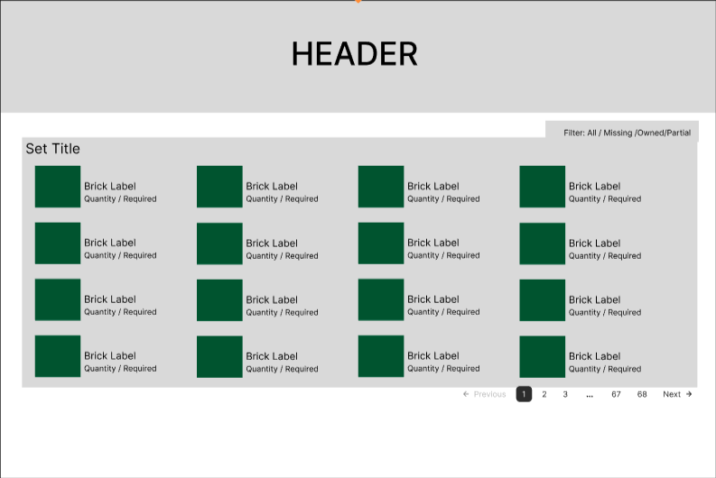
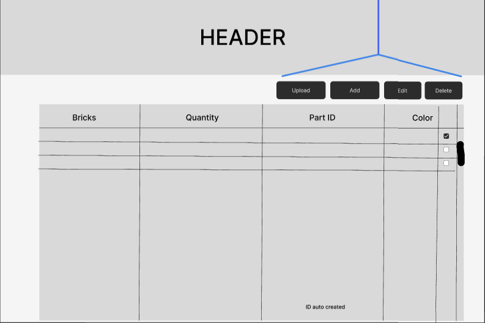
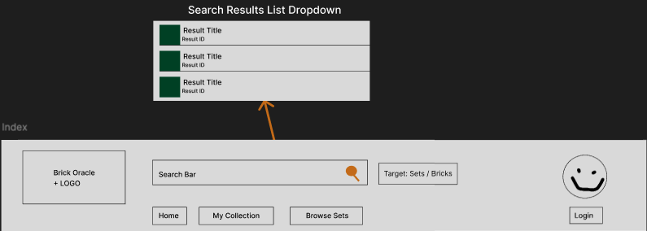

# PAGE_TESTING.md

This document defines the **pages** Brick Oracle will implement and what is required to (1) render them correctly and (2) test them consistently.

---

## Conventions Used in This Document

### Parameter Types
- **Route params**: values embedded in the URL path (e.g., `/sets/:setId`)
- **Query params**: values after `?` in the URL (e.g., `?filter=missing`)
- **State params**: values passed through navigation state (optional; avoid for critical data)

### Data Types
- **Auth state**: current user identity + session token
- **API data**: data fetched from backend services
- **UI state**: transient values like form fields, selected filters, toggles

---

# 1) Home Page

## Page Title
Home Page

## Page Description
Purpose: Introduce Brick Oracle and give users a quick snapshot of their collection and the database. Provides entry points to the core features.

**Mockup:**

## Parameters Needed for the Page
- Route params: none
- Query params: none

## Data Needed to Render the Page
- Auth state:
  - If the user is not logged in, Bricks in Collection will return N/A
  - If the user is not logged in, Sets You Can Build will return N/A
- API data:
  - `getSets()` → `List<SetDTO>`
  - `getUserCollection()` → `CollectionDTO`
  - `getRecommendedSets()` → `List<SetDTO>`
- User data: `userid`, `username` (Mocked for non-authenticated user)
- UI state:
  - Bricks in Collection and Sets You Can Build are conditionally shown with accurate numbers only when the user is logged in
  - Cards rendering Total Sets, Bricks in Collection, and Sets You Can Build counts
  - Set carousel that iteratively shows sets from the database
    - Icon in the top right of each card indicates if the set is buildable or partially complete given the user's collection
  - Clicking carousel chevrons moves the viewed sets left or right

## Link Destinations for the Page
- **My Collection** nav → `/collection`
- **Browse Sets** nav → `/sets`
- **Login** button → `/auth`
- **User profile icon** → `/auth` (if logged out) or profile dropdown (if logged in)
- **Set card** → `/sets/:setId`

## Tests for Verifying Rendering of the Page
- Assert that the total sets count appears and is correct
- Assert that the total number of bricks in collection appears and is correct
- Assert that the total number of sets you can build given your collection appears and is correct
- Assert that if the user is not logged in, Bricks in Collection and Sets You Can Build show N/A
- Assert that the sets carousel renders and shows some number of sets by default
- Assert that clicking the left carousel chevron shifts all sets by 4 (e.g., viewing 1–4 out of 100 becomes 96–100)
- Assert that clicking the right carousel chevron shifts all sets by 4 (e.g., viewing 1–4 becomes 5–9)
- Assert that clicking a set card in the carousel navigates to `/sets/:setId`

---

# 2) Auth

## Page Title
Auth (Login)

## Page Description
Purpose: Authenticate returning users via email and password.

**Mockup:**

## Parameters Needed for the Page
- Route params: none
- Query params: optional `?redirect=/path` (post-login redirect target)

## Data Needed to Render the Page
- UI state: email field, password field, validation errors, loading state
- API data: `POST /api/auth/login` → session token + user id on success
- User data: session token (e.g., localStorage or cookie)

## Link Destinations for the Page
- **Sign In** success (default) → `/collection`
- **Sign In** success (with redirect) → `?redirect=/path`
- **Sign In** failure → `/auth`

## Tests for Verifying Rendering of the Page
- Assert that login form inputs are present when no user is logged in and no session token is found
- Assert that the Sign In button is present when no user is logged in and no session token is found
- Assert that the page redirects to the collection page when a user is already logged in and a session token is found
- Assert that filling out the form with invalid credentials does not sign the user in and returns them to `/auth` with error text indicating sign-in failed
- Assert that filling out the form with valid credentials redirects the user to `/collection` (or the provided `?redirect` path) and stores a session token

---

# 3) Set Browser

## Page Title
Set Browser

## Page Description
Page that displays all of the sets uploaded to the site by a user.

**Mockup:**

## Parameters Needed for the Page
- Route params: none
- Query params:
  - `?page=` current page number (default: 1)
  - `?theme=` filter by theme (optional)

## Data Needed to Render the Page
- API data: `getSets()`, `getSet()`, `getUserSets()`
- UI state: HTML template, CSS styling, images/data to display sets, current page results
- User data (optional): `userid`, `username` (Mocked for non-authenticated user)

## Link Destinations for the Page
- **Set card** → `/sets/:setId`
- **Home Page** → `/`
- **Auth** → `/auth`

## Tests for Verifying Rendering of the Page
- Assert that when logged in the page contains the sets for that user
- Assert that when logged out the page contains all sets in a carousel to explore
- Assert that pagination elements are present and clickable to show a new set of results
- Assert that pagination is disabled beyond available sets so the user doesn't see a blank screen
- Assert that a set card contains a valid thumbnail, title, and other identifying information
- Assert that clicking a set card navigates the user to the corresponding `/sets/:setId` page

---

# 4) Set Builder

## Page Title
Set Builder (Brick Diff)

## Page Description
Purpose: Display the details of an individual set and diff it against the user's collection.

**Mockup:**

## Parameters Needed for the Page
- Route params:
  - `setId` (required) from `/sets/:setId`
- Query params:
  - `?filter=all|missing|owned` (default: `all`)

## Data Needed to Render the Page
- Auth state: current user id (required)
- API data:
  - `GET /api/sets/:setId` → set name and metadata
  - `GET /api/sets/:setId/diff?userId=...` → list of `BrickDiffDTO` (brick info + user qty + required qty per brick)
- UI state: active filter (All / Missing / Owned)

## Link Destinations for the Page
- **Header nav** → back to `/sets`

## Tests for Verifying Rendering of the Page
- Assert that unauthenticated user is redirected to `/auth`
- Assert that set name appears at the top of the page
- Assert that brick cards are visible with label and quantity
- Assert that selecting "Missing" shows only bricks where user quantity is less than required quantity
- Assert that selecting "Owned" shows only bricks where user quantity is the same as or greater than required quantity

---

# 5) Collection Browser

## Page Title
Collection Browser

## Page Description
A page for a user to manage their brick collection and sets.

**Mockup:**

## Parameters Needed for the Page
- Route params: `/collection_browser/setUpdate`
- Query params: `?set=SETNAME` (selecting a set to update/delete queries the correct data)

## Data Needed to Render the Page
- Auth state: confirm user token before displaying data
- API data:
  - `getSets()`
  - `getBricks()`
  - `PUT/POST` bricks and sets
  - `deleteSets()`
- UI state:
  - HTML template with scrollable table (`overflow-y`)
  - CSS styling
  - Buttons to update page content
  - Appropriate display cards appear after clicking a button

## Link Destinations for the Page
- `/collection_browser`

## Tests for Verifying Rendering of the Page
- Assert positive and negative tests for data types in row entries:
  - Brick name displays as string
  - Brick quantity displays as number
  - Part ID is a number
  - Color is a string (potentially hex code)
- Assert that buttons perform the appropriate API call
- Assert positive and negative tests for user auth:
  - Displays correct data for a valid user auth token
  - Refuses to display data on invalid auth token

---

# 6) Header

## Page Title
None (shared component — behavior defined per page)

## Page Description
The Header is a shared component that is conditionally rendered depending on the page it appears on.

**Mockup:**

## Parameters Needed for the Page
- Route params: none
- Query params: none

## Data Needed to Render the Page
- Auth state: no auth state shows Login button with AN (anonymous) user profile; user can still use the search bar
- API data:
  - User data: `userid`, `username` (for profile image and login status)
  - Brick Oracle logo and title string
  - Search API: `getSets(filterOptions)`, `getBricks(filterOptions)`
- UI state:
  - Text input with magnifying glass button for search, with Set / Bricks filter on results
  - HTML table for `ResultDTO`s returned from search
  - Home | My Collection | Browse Sets nav buttons
  - Brick Oracle title with logo
  - User profile icon with Login button

## Link Destinations for the Page
- **Home** → `/`
- **My Collection** → `/collection`
- **Browse Sets** → `/sets`

## Tests for Verifying Rendering of the Page
- Assert that the Home button appears and navigates to the home page
- Assert that the My Collection button appears and navigates to `/collection`
- Assert that the Browse Sets button appears and navigates to `/sets`
- Assert that the Login button navigates to `/auth`
- Assert that the Login button renders only when the user is not logged in
- Assert that the profile icon appears and reflects the user's username, or AN for anonymous user
- Assert that the Brick Oracle title and logo appear
- Assert that the search bar, magnifying glass, and target filter options appear
- Assert that entering a search term and clicking the magnifying glass returns results matching that term
- Assert that when the Sets filter is selected, search results return only sets
- Assert that when the Bricks filter is selected, search results return only bricks
- Assert that the results table appears when a search term is entered and the magnifying glass is clicked
