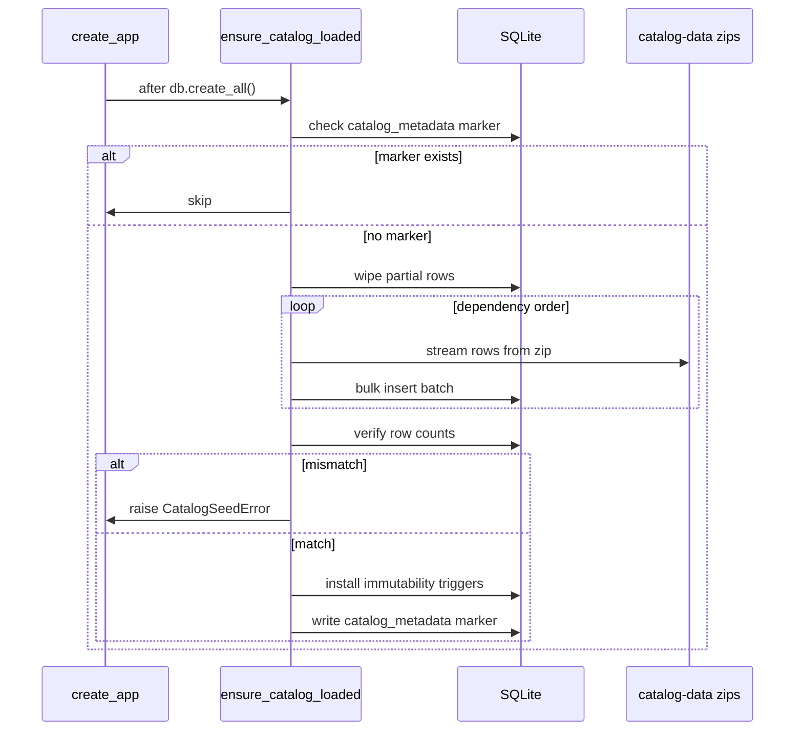

# Brick Oracle API

Flask + SQLAlchemy backend for the Brick Oracle project. On first boot, the app seeds an **immutable SQLite catalog** from the Rebrickable CSV zips in [`assets/catalog-data/`](../../assets/catalog-data/). Table schemas and relationships are documented in [`SQL_TESTING.md`](../../SQL_TESTING.md).

## Project layout

```
backend/brick-oracle-api/
  main.py                 # WSGI entrypoint: from src import create_app
  pyproject.toml
  instance/               # gitignored; holds brick_oracle.sqlite3
  src/
    __init__.py           # create_app() factory
    config.py             # env-based defaults
    extensions.py         # db = SQLAlchemy()
    models/
      catalog.py          # 12 ORM models + CatalogMetadata marker
    catalog/
      csv_source.py       # stream rows from *.csv.zip with type coercion
      loader.py           # dependency-ordered bulk insert (5k-row batches)
      verify.py           # CSV vs DB row-count check
      triggers.py         # SQLite immutability triggers
      seed.py             # ensure_catalog_loaded() orchestration
      repository.py       # read-only query helpers
  tests/
    conftest.py           # tiny synthetic catalog zip fixtures
    test_catalog_seed.py
```

Import convention: `from src import create_app` (same as `main.py` and the test suite).

## Running

One-time setup:

```bash
cd backend/brick-oracle-api
uv sync --group dev
```

Tests:

```bash
uv run pytest
```

Dev server (seeds on first boot if zips are present):

```bash
uv run flask --app main run
```

Auto-reload on file changes:

```bash
uv run flask --app main run --reload
```

Auto-reload plus interactive debugger on errors:

```bash
uv run flask --app main run --debug
```

The SQLite database is created at `instance/brick_oracle.sqlite3` (gitignored). Delete that file to force a full re-seed.

## Configuration

Set via environment variables or `create_app(config_overrides={...})`:

| Variable | Default | Purpose |
| --- | --- | --- |
| `BRICK_ORACLE_DATABASE_URI` | `sqlite:///<instance>/brick_oracle.sqlite3` | Database connection string |
| `CATALOG_DATA_DIR` | auto-discovered `assets/catalog-data` | Directory containing the 12 `*.csv.zip` files |
| `BRICK_ORACLE_SKIP_CATALOG_SEED` | unset (false) | Skip seeding entirely when truthy |

`CATALOG_DATA_DIR` is resolved by walking up from `src/config.py` until an `assets/catalog-data` folder is found, so it works regardless of the current working directory.

## Catalog seeding

`create_app()` calls `db.create_all()` then `ensure_catalog_loaded(app)` unless `SKIP_CATALOG_SEED` is set. The seed runs **once**; subsequent startups are no-ops.



**Load order** (parents before children): `part_categories → colors → themes → parts → minifigs → sets → elements → part_relationships → inventories → inventory_parts → inventory_minifigs → inventory_sets`.

**Verification**: each table's CSV data-row count must match `SELECT COUNT(*)` in the DB. Any mismatch rolls back the entire transaction and raises `CatalogSeedError`, so the app never starts with partial data.

Expected row counts from the current Rebrickable dump:

| Table              | Rows      |
| ------------------ | --------- |
| part_categories    | 76        |
| colors             | 275       |
| themes             | 494       |
| parts              | 63,359    |
| minifigs           | 16,985    |
| sets               | 27,194    |
| elements           | 112,372   |
| part_relationships | 36,637    |
| inventories        | 46,095    |
| inventory_parts    | 1,525,092 |
| inventory_minifigs | 25,482    |
| inventory_sets     | 5,052     |

**CSV access**: rows are read directly from the zips via `zipfile` + `csv.DictReader` — never unzipped to disk. Type coercion handles booleans (`"True"/"False"`), nullable ints (`""` → `None`), and required fields.

**Performance**: the seed temporarily sets `PRAGMA synchronous=OFF` and `journal_mode=MEMORY`, then restores normal settings. `inventory_parts` (~1.5M rows) is inserted in 5,000-row batches via SQLAlchemy Core.

## Immutability

The 12 catalog tables are an **immutable base layer**. Two enforcement layers:

1. **App layer** — [`src/catalog/repository.py`](src/catalog/repository.py) exposes only `get_*` and `list_*` helpers. Do not add create/update/delete helpers for catalog data anywhere in the app.
2. **DB layer** — after a successful seed, `BEFORE UPDATE` and `BEFORE DELETE` triggers on all 12 catalog tables raise `ABORT` on any mutation. Triggers persist in the SQLite file across restarts. The `catalog_metadata` marker table is intentionally **not** covered.

## Data access

All catalog reads go through `src.catalog.repository`. Use these inside a Flask app context:

| Method | Description |
| --- | --- |
| `get_set(set_num)` / `list_sets(limit=50, offset=0)` | Fetch or paginate LEGO sets |
| `get_part(part_num)` / `list_parts_by_category(part_cat_id)` | Fetch a part or list by category |
| `get_color(color_id)` / `list_colors()` | Fetch or list all colors |
| `get_theme(theme_id)` / `list_root_themes()` | Fetch a theme or list top-level themes |
| `get_minifig(fig_num)` | Fetch a minifig |
| `get_part_category(category_id)` / `list_part_categories()` | Fetch or list part categories |
| `get_inventory(inventory_id)` / `list_inventories_for_set(set_num)` | Fetch an inventory or list versions for a set |
| `list_inventory_parts(inventory_id)` | Parts in an inventory |
| `list_inventory_minifigs(inventory_id)` | Minifigs in an inventory |
| `list_inventory_sets(inventory_id)` | Sub-sets in an inventory |
| `list_elements_for_part(part_num)` | All elements for a part |
| `list_part_relationships_for_part(part_num)` | Relationships where the part is child or parent |

Example:

```python
from src import create_app
from src.catalog.repository import get_set, list_inventory_parts

app = create_app()
with app.app_context():
    lego_set = get_set("75192-1")
    if lego_set:
        for inv in lego_set.inventories:
            parts = list_inventory_parts(inv.id)
```

ORM models in `src.models.catalog` are also available for direct queries, but prefer the repository helpers to stay within the read-only convention.

## Testing

Tests use tiny synthetic `*.csv.zip` fixtures built in-memory by `tests/conftest.py` (a handful of rows per table, not the full dataset). The app is pointed at them via `CATALOG_DATA_DIR` in the `app_config` fixture.

`test_catalog_seed.py` covers:

- First run seeds all 12 tables and writes the `catalog_metadata` marker
- Second run is a no-op (idempotent, single marker row)
- Inflated CSV row count aborts the seed with no partial data committed
- `UPDATE`/`DELETE` on catalog tables are blocked by SQLite triggers
- Triggers survive app restart (persist in the DB file)

Running the seed against the real 1.5M-row `inventory_parts.csv` is a manual/local smoke check, not part of the automated suite.

## Notes

- The `assets/catalog-data/` zips are **not tracked in git** and must be present on disk locally for seeding to succeed.
- No HTTP API routes expose catalog data yet — this work lands the data layer only.
- Extended CSV columns beyond the original schema (`colors.num_parts/num_sets/y1/y2`, `elements.design_id`, `parts.part_material`, `sets/minifigs/inventory_parts.img_url`) are captured in the models and documented in `SQL_TESTING.md`.
